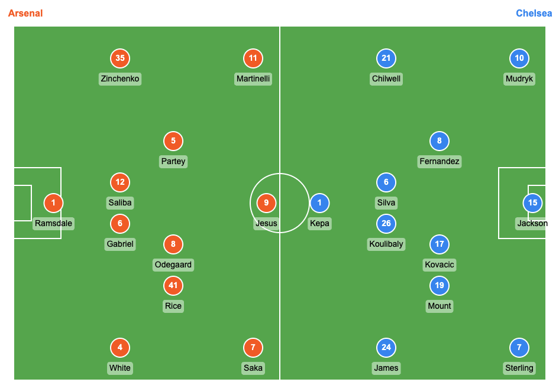
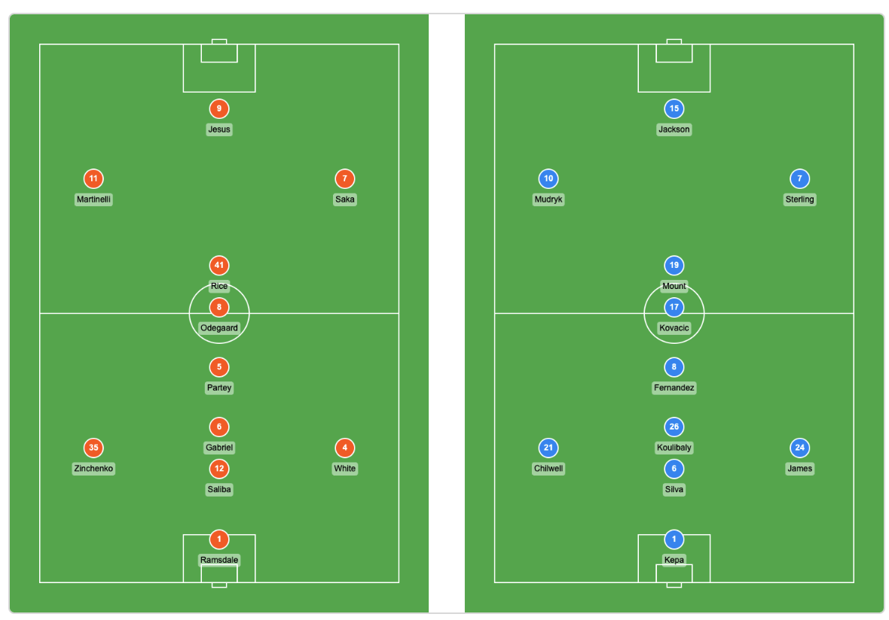

# Football Lineup Generator

[](https://badge.fury.io/js/football-lineup-generator)
[](https://www.npmjs.com/package/football-lineup-generator)
[](https://github.com/ncamaa/football-lineup-generator/stargazers)
[](https://github.com/ncamaa/football-lineup-generator/network)
[](https://github.com/ncamaa/football-lineup-generator/issues)
[](https://opensource.org/licenses/MIT)

A TypeScript library for generating visual football (soccer) lineup diagrams from team positioning data. Create beautiful, interactive lineup visualizations that can be easily embedded in web applications.

## Live Demo

🚀 **[Try the live demo here](https://ncamaa.github.io/football-lineup-generator/)**

## Features

- 🏈 Generate visual football field with accurate proportions
- 👥 Position players based on their assigned roles
- 🎨 Customizable colors, sizes, and styling
- 📱 Responsive and scalable canvas-based rendering
- 🔧 TypeScript support with full type definitions
- ⚡ Lightweight with no external dependencies
- 🏆 Support for substitutes and bench players

## Screenshots

| Full Pitch | Half Pitch | Split Pitch |
|:----------:|:----------:|:-----------:|
|  |  |  |

## Development

### Getting Started

1. **Install dependencies:**

   ```bash
   npm install
   ```
2. **Start development environment:**

   ```bash
   	npm run dev
   ```

   This will:

   - Compile TypeScript in watch mode (auto-recompiles on file changes)
   - Start an HTTP server on `http://localhost:3000`
   - Automatically open `example.html` in your browser
   - Enable CORS for local development
3. **Alternative commands:**

   ```bash
   npm start          # Same as npm run dev
   npm run build      # One-time TypeScript compilation
   npm run watch      # TypeScript watch mode only
   npm run serve      # HTTP server only
   ```

### Development Workflow

- Make changes to TypeScript files in the `src/` directory
- Changes are automatically compiled and reflected in the browser
- Open `http://localhost:3000` to see the example page
- The example page loads the compiled library from `dist/index.js`

### Project Structure

```
src/
├── functions/          # Core rendering functions
├── index.ts           # Main library entry point
├── renderer.ts        # Football lineup renderer class
└── types.ts          # TypeScript type definitions
```

## Installation

```bash
npm install football-lineup-generator
```

## Usage

### TypeScript/ESM

```typescript
import { generateLineup, FootballLineupRenderer, Team, Position, LayoutType } from 'football-lineup-generator';
```

### CommonJS

```js
const { generateLineup, FootballLineupRenderer, Team, Position, LayoutType } = require('football-lineup-generator');
```

## Quick Start

```typescript
import { generateLineup, Team, Position, LayoutType } from 'football-lineup-generator';

// Define your lineup data
const lineupData = {
  homeTeam: {
    name: "Arsenal",
    players: [
      {
        player: { id: 1, name: "Ramsdale", jerseyNumber: 1 },
        team: Team.RED,
        position: Position.GOALKEEPER
      },
      {
        player: { id: 2, name: "White", jerseyNumber: 4 },
        team: Team.RED,
        position: Position.RIGHT_BACK
      },
      // ... more players
    ]
  },
  awayTeam: {
    name: "Chelsea",
    players: [
      {
        player: { id: 11, name: "Kepa", jerseyNumber: 1 },
        team: Team.YELLOW,
        position: Position.GOALKEEPER
      },
      // ... more players
    ]
  }
};

// Generate the lineup canvas (now async)
const canvas = await generateLineup(lineupData, {
  layoutType: LayoutType.SPLIT_PITCH,
  backgroundImage: 'path/to/field-image.jpg'
});

// Add to your DOM
document.body.appendChild(canvas);
```

## API Reference

### `generateLineup(lineupData, config?)`

Creates a canvas element with a football lineup visualization.

**Parameters:**

- `lineupData` (LineupData): The lineup data containing both teams' player positions
- `config` (LineupConfig, optional): Configuration options for the visualization

**Returns:** `HTMLCanvasElement` that can be added to the DOM

### `generateLineupFromPositioning(positioningData, homeTeamName, awayTeamName, config?)`

Convenience function to create a lineup from backend positioning data format.

**Parameters:**

- `positioningData` (Array): Array of positioning data from backend
- `homeTeamName` (string): Name of the home team
- `awayTeamName` (string): Name of the away team
- `config` (LineupConfig, optional): Configuration options

**Returns:** `HTMLCanvasElement`

## Configuration Options

```typescript
interface LineupConfig {
  width?: number;              // Canvas width (default: 800)
  height?: number;             // Canvas height (default: 600)
  layoutType?: LayoutType;     // Layout type (default: FULL_PITCH)
  showPlayerNames?: boolean;   // Show player names (default: true)
  showJerseyNumbers?: boolean; // Show jersey numbers (default: true)
  fieldColor?: string;         // Field background color (default: '#4CAF50')
  lineColor?: string;          // Field line color (default: '#FFFFFF')
  homeTeamColor?: string;      // Home team player color (default: '#FF5722')
  awayTeamColor?: string;      // Away team player color (default: '#2196F3')
  fontSize?: number;           // Text font size (default: 12)
  playerCircleSize?: number;   // Player circle radius (default: 20)
  backgroundImage?: string | HTMLImageElement; // Custom background image
}
```

## Layout Types

```typescript
enum LayoutType {
  FULL_PITCH = "full_pitch",   // Both teams positioned across the entire pitch
  HALF_PITCH = "half_pitch",   // Each team positioned in their respective half
  SPLIT_PITCH = "split_pitch"  // Two separate parallel pitches side by side
}
```

## Team and Position Enums

### Team

```typescript
enum Team {
  RED = "red",
  YELLOW = "yellow"
}
```

### Position

```typescript
enum Position {
  GOALKEEPER = "goalkeeper",
  CENTER_BACK = "center_back",
  LEFT_BACK = "left_back",
  RIGHT_BACK = "right_back",
  DEFENSIVE_MIDFIELDER = "defensive_midfielder",
  CENTER_MIDFIELDER = "center_midfielder",
  ATTACKING_MIDFIELDER = "attacking_midfielder",
  LEFT_MIDFIELDER = "left_midfielder",
  RIGHT_MIDFIELDER = "right_midfielder",
  LEFT_WINGER = "left_winger",
  RIGHT_WINGER = "right_winger",
  CENTER_FORWARD = "center_forward",
  LEFT_FORWARD = "left_forward",
  RIGHT_FORWARD = "right_forward",
  SUBSTITUTE = "substitute"
}
```

## Layout Options Examples

### Full Pitch Layout (Default)

Both teams positioned across the entire field with traditional mirrored positioning.

```typescript
const canvas = await generateLineup(lineupData, {
  layoutType: LayoutType.FULL_PITCH
});
```

### Half Pitch Layout

Each team positioned only in their respective half for clearer visualization.

```typescript
const canvas = await generateLineup(lineupData, {
  layoutType: LayoutType.HALF_PITCH
});
```

### Split Pitch Layout

Two separate parallel pitches side by side, each showing one team's formation.

```typescript
const canvas = await generateLineup(lineupData, {
  layoutType: LayoutType.SPLIT_PITCH
});
```

## Background Image Support

Add custom field backgrounds using image URLs or loaded Image elements:

```typescript
// Using image URL
const canvas = await generateLineup(lineupData, {
  backgroundImage: 'https://example.com/field-texture.jpg'
});

// Using loaded Image element
const img = new Image();
img.src = 'path/to/custom-field.jpg';
img.onload = async () => {
  const canvas = await generateLineup(lineupData, {
    backgroundImage: img
  });
  document.body.appendChild(canvas);
};
```

## Advanced Example

```typescript
import { generateLineup, Team, Position, LayoutType } from 'football-lineup-generator';

// Create a 4-3-3 formation
const lineupData = {
  homeTeam: {
    name: "Manchester City",
    players: [
      // Goalkeeper
      { player: { id: 1, name: "Ederson", jerseyNumber: 31 }, team: Team.RED, position: Position.GOALKEEPER },
    
      // Defense
      { player: { id: 2, name: "Walker", jerseyNumber: 2 }, team: Team.RED, position: Position.RIGHT_BACK },
      { player: { id: 3, name: "Dias", jerseyNumber: 3 }, team: Team.RED, position: Position.CENTER_BACK },
      { player: { id: 4, name: "Stones", jerseyNumber: 5 }, team: Team.RED, position: Position.CENTER_BACK },
      { player: { id: 5, name: "Cancelo", jerseyNumber: 27 }, team: Team.RED, position: Position.LEFT_BACK },
    
      // Midfield
      { player: { id: 6, name: "Rodri", jerseyNumber: 16 }, team: Team.RED, position: Position.DEFENSIVE_MIDFIELDER },
      { player: { id: 7, name: "De Bruyne", jerseyNumber: 17 }, team: Team.RED, position: Position.CENTER_MIDFIELDER },
      { player: { id: 8, name: "Silva", jerseyNumber: 20 }, team: Team.RED, position: Position.CENTER_MIDFIELDER },
    
      // Forward
      { player: { id: 9, name: "Mahrez", jerseyNumber: 26 }, team: Team.RED, position: Position.RIGHT_WINGER },
      { player: { id: 10, name: "Haaland", jerseyNumber: 9 }, team: Team.RED, position: Position.CENTER_FORWARD },
      { player: { id: 11, name: "Grealish", jerseyNumber: 10 }, team: Team.RED, position: Position.LEFT_WINGER },
    ]
  },
  awayTeam: {
    name: "Liverpool",
    players: [
      // Add Liverpool players here...
    ]
  }
};

// Custom configuration with split pitch and background image
const config = {
  width: 1000,
  height: 700,
  layoutType: LayoutType.SPLIT_PITCH,
  fieldColor: '#2E7D32',
  homeTeamColor: '#87CEEB',
  awayTeamColor: '#DC143C',
  fontSize: 14,
  playerCircleSize: 25,
  backgroundImage: 'https://example.com/stadium-field.jpg'
};

const canvas = await generateLineup(lineupData, config);
document.getElementById('lineup-container').appendChild(canvas);
```

## Backend Integration

If you're using the positioning data format from your backend:

```typescript
import { generateLineupFromPositioning, Team, Position } from 'football-lineup-generator';

// Backend data format
const backendData = [
  {
    match_id: 1,
    player_id: 1,
    player_name: "Lionel Messi",
    jersey_number: 10,
    team: Team.RED,
    position: Position.RIGHT_WINGER
  },
  // ... more positioning data
];

const canvas = generateLineupFromPositioning(
  backendData,
  "PSG",
  "Barcelona"
);
```

## Browser Compatibility

This library works in all modern browsers that support HTML5 Canvas:

- Chrome 4+
- Firefox 2+
- Safari 3.1+
- Edge (all versions)
- Internet Explorer 9+

## Contributing

Contributions are welcome! Please feel free to submit a Pull Request.

## License

MIT License - see LICENSE file for details.

## Changelog

### 1.0.0

- Initial release
- Basic lineup generation
- Canvas-based rendering
- TypeScript support
- Customizable styling
